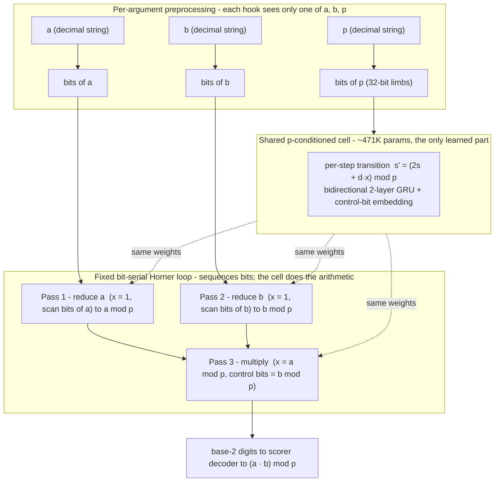

<p align="center">
  
</p>

# NeuralHorner: a modulus-conditioned bit-serial neural reducer

**Clears tiers 1-10 (official scorer, local, 3 seeds, under budget.)** One small recurrent cell, conditioned on the prime `p` and run in a fixed bit-serial loop, computes `(a · b) mod p` for primes and operands far beyond 64 bits. This repository is the SAIR Modular Arithmetic Challenge entry plus the supporting study: where the construction works, exactly where it breaks, and a machine-checked proof of the integer algorithm it imitates.

> **Status: ongoing research.** The accuracy, timing, determinism, bf16-safety, and weight-perturbation results below are from the official open-source scorer run locally via RunPod on a single H100. What is *not* yet established (organizer-at-scale verification, the compliance ruling, exactness) is stated plainly in [What is not established](#what-is-not-established).

**Paper:** [paper/paper_neuralhorner.pdf](paper/paper_neuralhorner.pdf) (13 pp).

## Architecture

NeuralHorner is one shared, modulus-conditioned bidirectional 2-layer GRU cell (~471K parameters) applied in a fixed bit-serial Horner loop. The cell learns the per-step transition `s' = (2s + d·x) mod p`; the same weights reduce `a`, reduce `b`, and multiply the two residues. State is carried as bits between steps; the modulus is fed as 32-bit limbs. Inference sizes the per-step state width to each prime's bit-length (dynamic-L), which is correctness-preserving because the padded high bits are always zero. Preprocessing is per-argument. The scorer entry class is `model.BitSerialReducer`.

The same learned cell runs at every step of a fixed bit-serial schedule; the loop sequences bits and does no arithmetic itself — the arithmetic is the learned cell's.


<details><summary>text version (Mermaid fallback)</summary>


</details>

## Training (summary)

The cell is trained from random initialization to predict the per-step transition on bit-length-stratified primes (AdamW with warmup + cosine decay, warm-started across widths), followed by an on-policy DAgger pass to close long-chain drift. Full methodology is in the [paper](paper/paper_neuralhorner.pdf); the training script will be released alongside it.

## Results

Official open-source scorer, full 1100-problem battery, run locally on a single H100. The three seeds are `a1a1a1a1`, `b2b2b2b2`, `c3c3c3c3`. Receipts: `model/receipts/d_*.json`.

| Property | Result |
|---|---|
| Tiers cleared | 1-10 (htA90 = 10), overall 1.00 |
| Seeds | 3 independent runs, identical |
| Wall-clock | 163-174 s per run (300 s budget, ~125 s margin) |
| Determinism | re-run gives identical per-tier counts |
| bf16 vs fp32 | 0 flipped answers on the battery; min \|logit\| = 3.017 (>> bf16 error) |
| Weight perturbation | randomizing the weights collapses every tier 0.00 (64/64 to 0/64) |
| Per-step transition | exact on all 40954 states of all primes < 64 (exhaustive) |
| Held-out adversarial battery | 759/768 = 98.83% (disjoint families) |

_Exact Clopper–Pearson 95% CIs: each cleared tier (100/100) [0.964, 1.000]; full 1100-problem battery [0.9967, 1.000]; held-out battery [0.978, 0.995]; Fermat family (119/128) [0.871, 0.967]._

- **Cross-prime transfer.** Trained on one width regime, the cell reduces and multiplies modulo primes it never saw during training. A monolithic learner on this setting reports ~0% (Lauter 2024).
- **Learned, not a circuit.** Randomizing the weights collapses every tier to 0.00 (the organizers' named weight-perturbation anti-cheat). The forward path contains no symbolic-math library, no big-integer modular multiply, no lookup table, and no compare-against-`p` on the operands.
- **Not exact.** The held-out adversarial battery scores 759/768 = 98.83%; the only failing family is Fermat numbers (`2^(2^n) + 1`), i.e. power-of-two-adjacent operands — and within that family the failures concentrate at the largest tested operand, `F_11 = 2^2048 + 1` (the top of the trained width range). The fragility is narrow and characterized, but real.

## Speed: dynamic state-width sizing

The per-step state only ever needs the prime's bit-length, so sizing it per batch (dynamic-L) instead of a fixed maximum removes the compute the easy tiers otherwise spend on padding. This cut wall-clock from 383 s to 163-174 s, inside the 300 s budget.

CUDA graphs were tried and lost (402 s > 383 s baseline). The workload is compute-bound (the per-step GRU runs over the L-wide state), not launch-bound, so graph capture did not help; removing the wasted easy-tier compute did. We report the negative result because it explains why dynamic-L is the right lever.

## Verified algorithm (Lean 4)

`lean/` machine-checks (axioms `propext` and `Quot.sound`; no `sorry`/`admit`) the integer double-and-add `mod p` recurrence that the loop imitates, for any bit length. The package certifies the *integer algorithm*. It does **not** cover the learned network: the cell-to-step bridge connecting the trained weights to the proven step is open.

Toolchain: `leanprover/lean4:v4.31.0`. Build with `lake build` from `lean/`.

## Reproduce

```bash
pip install torch numpy                                            # model dependencies
# install the official scorer (modchallenge) from github.com/SAIRcompetition/modular-arithmetic-challenge, then:
modchallenge evaluate model --total 1100                           # tiers 1-10, overall 1.00
python scripts/verify_no_shortcut.py model --randomize   # weights randomized -> collapse to 0
python scripts/held_out_battery.py model --n 128         # disjoint adversarial families
cd lean && lake build                                              # the machine-checked integer algorithm
```

Per-step exhaustive check (all states, primes < 64):

```bash
python scripts/per_step_exhaustive.py model --pmax 64
```

Every number above has a committed receipt under `model/receipts/` (official eval per seed, determinism re-run, dynamic-L timing). The bf16 margin and weight-collapse checks are `scripts/bf16_margin_check.py` and `scripts/verify_no_shortcut.py`.

## What is not established

- **Automated leaderboard evaluation: 100% on all ten tiers; final ranked standing pending.** On submission, the competition's automated evaluation scored the model tiers 1-10 = 100% (htA90 = 10) at 260s, inside the 300s budget. This is the competition's automated scorer, not a human or organizer verification, and the final ranking is not decided. The local 3-seed runs (163-174s) agree.
- **Compliance ruling pending.** Official rulings depend on organizers and judges only. The entry passes the organizers' weight-perturbation test, and looped models whose answer comes from trained parameters are permitted, but the schedule-specific ruling or review has not occurred.
- **Not exact.** See the held-out battery above (759/768; Fermat-number failures). Tier-level scores of 1.00 are on the scorer's random-operand distribution, not a proof of exactness.
- **Timing under the competition's evaluation.** The automated evaluation reported 260s on submission (slower than our 174s H100 runs), still inside the 300s budget.
- **Proof scope.** The Lean package proves the integer algorithm, not the trained network.

## Roadmap

NeuralHorner is the most-scaffolded point — **"Level 0"** — of a planned scaffold-removal study, not the end state. The arc hands the fixed schedule back to the network in stages, to measure *how much algorithmic structure must be fixed* before neural modular arithmetic generalizes across primes:

- **Level 0** (this repo): fixed Horner loop + learned per-step transition.
- **Level 1**: learned controller (the network decides when to reduce / multiply) + learned transition.
- **Level 2**: learned latent state, no explicit residue-bit representation.
- **Level 3**: a Neural-GPU-style recurrent bit processor — no Horner phases.
- **Level 4**: a looped / universal transformer.
- **Level 5**: a monolithic transformer (the original wall).

Nearer-term:
- Failure-mode analysis + fix of the power-of-two-adjacent (Fermat) family (custom data distribution / targeted DAgger; the failure concentrates at `F_11`).
- Trace-certification on the deep tiers + Fermat first-divergence localization.
- Ablations: no modulus-conditioning, no DAgger, fixed-L vs dynamic-L.
- Training-script release; preprint.

## Citation

See [`CITATION.cff`](CITATION.cff). Robert Sneiderman, *NeuralHorner: a learned bit-serial modular reducer*, 2026. https://github.com/Robby955/neural-horner

## Author

Robert Sneiderman

Corrections and issues welcome.
