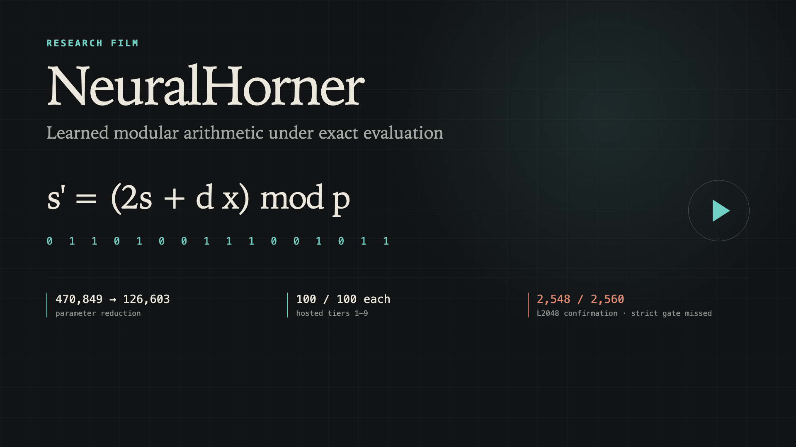
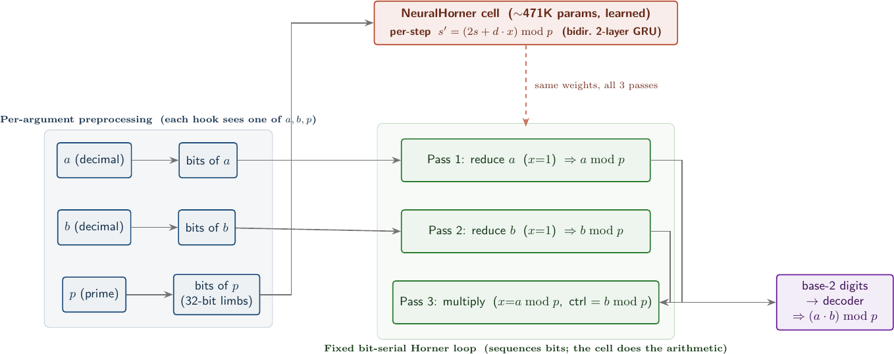

<p align="center">
  
</p>

# NeuralHorner

NeuralHorner studies exactness and length generalization in learned modular
arithmetic. It places a learned residue transition inside a fixed bit-serial
Horner program, then measures how model size, sequence width, and repair
objectives affect exact rollouts.

The repository contains the original 470,849-parameter v8 checkpoint, a
126,603-parameter compression study, structured counterexamples, crossed
schedule/weight ablations, and a Lean formalization of the underlying integer
algorithm.

[Original v8 paper draft (August 11, 2026)](paper/paper_neuralhorner.pdf) ·
[Original model](model/) ·
[Compression study](research/v02/) ·
[Lean formalization](lean/) ·
[Research record](research/)

The compression and L2048 results below postdate the paper draft. The frozen
compression protocol is under [`research/v02/`](research/v02/); the terminal
120,000-update receipts used by the film are under
[`video/research-film/evidence/`](video/research-film/evidence/).

## Research film

[](https://robby955.github.io/neural-horner/film/)

A 94-second silent film covering the modular-arithmetic problem, the fixed
Horner program, MiniNeuralHorner compression, the hosted evaluation, and the
full-width and Fermat failure boundaries.

[Play the film](https://robby955.github.io/neural-horner/film/)
· [Download mobile MP4](https://robby955.github.io/neural-horner/assets/neuralhorner-research-film-v1-mobile.mp4)
· [Release archive](https://github.com/Robby955/neural-horner/releases/tag/research-film-v1)
· [Source](video/research-film/)
· [Receipts](video/research-film/receipts/)

## Method

One modulus-conditioned recurrent cell predicts the binary residue update

$$
s_{t+1} = (2s_t + d_t x) \bmod p.
$$

The same cell is reused in three passes:

1. reduce `a` with `x = 1`;
2. reduce `b` with `x = 1`;
3. scan the bits of `b mod p` with `x = a mod p`.

The outer program fixes the pass order and bit order. The recurrent cell
predicts each modular state update, and its output is thresholded back to a
binary state before the next step.



| Component | Role |
|---|---|
| Learned cell | A two-layer bidirectional GRU conditioned on `s`, `x`, `p`, and the control bit `d` |
| Fixed program | Sequences the three Horner passes and carries the predicted binary state |
| Preprocessing | Encodes each argument separately as bits; it does not compute either operand modulo `p` |
| Decoder | Converts the final base-2 output digits to an integer |

The state width is chosen from the largest modulus in each batch. This
dynamic-width rule removes padding work on smaller cases. With the original v8
weights, a recorded six-case comparison agreed with fixed-width inference, and
local H100 runtime fell from 383 seconds to 163-174 seconds. The agreement is a
finite test of the trained network, not an identity proved for every input.

## Completed results

| Model | Parameters | Evaluation | Result |
|---|---:|---|---|
| [NeuralHorner v8](https://huggingface.co/TrickyRex/bitserial-modmul-v8/tree/301938693892043d66a8bf6ec60a9c5ab85549d4) | 470,849 | Pinned SAIR open-source scorer, self-run on H100 with one checkpoint and three operand seeds | T1-T10: 100/100 on every scored tier for every seed; recorded runtime 163-174 seconds |
| [MiniNeuralHorner v0.2](https://huggingface.co/TrickyRex/mini-neuralhorner-v02/tree/d9d611833d340c72d90a97d995a94031b798cf7c) | 126,603 | SAIR Playground, UI-transcribed | T1-T9: 100/100 on every tier; T10: 85/100; 985/1,000 scored cases; 156.602 seconds; 520 KB |

MiniNeuralHorner uses the same two-layer bidirectional architecture and fixed
three-pass program as v8, with GRU hidden width reduced from 128 to 61. It has
73.1% fewer parameters.

The runtimes are not directly comparable because the evaluations used
different surfaces. The v8 accuracy counts have repository receipts under
[`model/receipts/`](model/receipts/); its timings are documented in
[`model/RESULTS.md`](model/RESULTS.md) and the paper. The MiniNeuralHorner result
is a transcription of the completed Playground interface, with no public run
identifier. Its unscored T0 diagnostic was 40/100. The exact revision and all
displayed counts are preserved in the
[evidence record](research/v02/evidence/sair_playground_d9d611833d340c72d90a97d995a94031b798cf7c.json).

Randomizing the v8 weights reduced every scored tier from 64/64 to 0/64 in the
recorded perturbation check. The fixed schedule alone therefore does not
explain the scorer result.

## Compression and length transfer

The v0.2 pilot changed only GRU hidden width. Every arm used the same two-layer
bidirectional architecture, 96-dimensional input representation, binary state,
training stream, optimizer budget, and evaluation gates.

| Arm | Hidden width | Parameters | L128 endpoint |
|---|---:|---:|---|
| B471 | 128 | 470,849 | passed |
| B249 | 90 | 249,157 | passed |
| B127 | 61 | 126,603 | passed; selected for width continuation |
| B063 | 40 | 63,057 | failed the rollout gate |

B063 scored 40,954/40,954 on the finite small-prime transition test at fixed
L128 and at the deployed dynamic width, but it did not preserve exact
multi-step rollouts. B127 is therefore the smallest passing arm in this
one-seed pilot. The experiment does not establish a parameter lower bound.

B127 was then continued through progressively larger state widths:

| State width | Selected update | Outcome |
|---:|---:|---|
| 128 | 24,000 | 512/512 per tier and mode on tiers 4-6 |
| 256 | 21,000 | 512/512 per tier and mode on tiers 4-7 |
| 512 | 48,000 | 256/256 per tier and mode on tiers 6-8 |
| 1,024 | 0 | 256/256 per tier and mode on tiers 6-9 |
| 2,048 | none (120,000-update horizon) | 640/640 screen at update 120,000; 2,548/2,560 confirmation; strict gate failed |

The L1024 checkpoint was selected before an optimizer step. Its model tensors
are unchanged from the selected L512 checkpoint. Every selected stage through
L1024 also passed the finite small-prime transition checks in both fixed and
dynamic sequence contexts.

At L2048, update 3,000 repaired the 64-case tier-10 screen and kept every
fixed-width tier exact, but dynamic tier 7 scored 61/64 and dynamic tier 8
scored 63/64. The original run ended at update 60,000 without a joint screen
pass. An exact-state horizon extension restored the saved model, AdamW,
scheduler, and random-number-generator states and continued at the fixed
learning-rate floor. At update 120,000, all ten 64-case tier/mode screens were
exact. The larger confirmation scored 2,548/2,560: fixed tiers 6-10 scored
256, 256, 256, 256, and 252; dynamic tiers scored 255, 256, 254, 255, and 252.
Both small-prime transition checks were 40,954/40,954. The declared gate still
failed, so the checkpoint was not selected. This single-seed result shows
delayed recovery on the small screen without exact retention on the larger
confirmation; it does not establish a parameter lower bound or a general
grokking transition. The exact
[terminal receipt](video/research-film/evidence/l2048-horizon-120k-receipt.json)
is included with the film source.

## Structured failures and repair experiments

v8 was exact on the random scorer cases but scored 759/768 on its first
structured evaluation. All nine failures were Fermat-family cases. The battery
was later used to choose repair attempts, so it is now development evidence
rather than a sealed test set. The public Mini checkpoint was evaluated
separately on the same 128-case Fermat family and also scored 119/128; all nine
observed Mini failures were F11 rows. This output-only diagnostic does not
establish that Mini and v8 made the same predictions or followed the same
internal trajectories.

On five traced failing F11 probes, the first incorrect transition was the final
step of reducing `a = 2^2048 + 1`. It occurred after 2,048 correct steps at
`s = 2^2047`, on the largest modular wrap in that trajectory.

One experiment removed a learned operand-reduction pass. At the integer-program
level, this direct two-pass schedule reduces a source-bound recurrent bit-work
count by 20.001%; this is not a latency measurement. The interpolated L2-SP
checkpoint was exact on 193,116/193,116 teacher-prefix transitions across the
selected F11 trajectories. This was an inductive check rather than a sequential
rollout. In the broader retention run, it failed 3 of 512 attempted rows; 1,024
planned rows were not evaluated.

Crossing the original and repaired weights with the original and direct
schedules separated the three failures:

| Case | v8/original | v8/direct | repaired/original | repaired/direct | Finding |
|---|---:|---:|---:|---:|---|
| `003` | pass | pass | pass | fail | failure requires the weight-schedule interaction |
| `035` | pass | fail | pass | fail | failure follows the direct schedule |
| `110` | pass | pass | fail | fail | failure follows the repaired weights |

The targeted F11 gate passed, but the candidate did not retain accuracy on
different structured rollouts. Together with the B063 result, these experiments
show that finite transition checks and targeted trajectory certificates do not
establish retention on other long-rollout distributions.

The complete ledgers and receipt validators are in
[`research/FRONTIER_STATE.md`](research/FRONTIER_STATE.md) and
[`research/DIRECT_HORNER_RESEARCH.md`](research/DIRECT_HORNER_RESEARCH.md).

## Formal verification

The Lean development proves that the exact integer transition computes modular
reduction and that the three-pass Horner construction computes
`(a * b) mod p` at any bit depth. It also proves both orientations of the
two-pass integer program.

The conditional theorem `cellDirectModmul_eq_of_agreesFrom` formalizes the
trajectory-certificate argument: if a candidate cell agrees with the exact
transition at every state reached along a fixed scan, the composed result is
correct for that input. This theorem does not establish that a neural
checkpoint satisfies the premise.

The package contains no `sorry` or `admit`. Its axiom audit reports the standard
mathlib axioms `propext` and `Quot.sound`.

```bash
cd lean
lake build
lake env lean examples/CheckHorner.lean
```

See [`lean/README.md`](lean/README.md) for theorem scope and file layout.

## Reproduction and repository map

| Path | Contents |
|---|---|
| [`model/`](model/) | v8 inference code, weights, manifest, scorer results, and receipts |
| [`research/v02/`](research/v02/) | Compression trainer, frozen configurations, protocol, and completed evidence |
| [`research/`](research/) | Structured batteries, repair studies, causal traces, and evidence ledgers |
| [`lean/`](lean/) | Exact integer schedules and conditional trajectory theorems |
| [`paper/`](paper/) | Original v8 paper source, figures, and August 11, 2026 draft PDF |
| [`tests/`](tests/) | Receipt, provenance, scorer-binding, and training-protocol tests |

Install the Python dependencies and run the v0.2 protocol tests with:

```bash
python3 -m venv .venv
source .venv/bin/activate
python -m pip install -r requirements.txt pytest
python -m pytest tests/test_v02_training.py -q
```

The v8 replay is pinned to the SAIR scorer commit
`82510bba00a1126649bd76dd1a451f14d0b3eb60`. The verifier rejects a different
commit, modified scorer files, shadow imports, or an unclean scorer source tree.
The exact replay boundary is recorded in
[`research/receipts/scorer_runtime_contract_82510.json`](research/receipts/scorer_runtime_contract_82510.json).

The historical v8 training command and warm start were recovered, but the
checkpoint does not include optimizer, scheduler, or random-number-generator
state. The v0.2 trainer records those states and binds each selected checkpoint
to its source, configuration, environment, parent artifact, and evaluation
gate.

## Related work

XllentAI reported a learned modulus-conditioned Horner transition with hard
binary state and held-out-prime transfer before NeuralHorner's public release.
NeuralHorner uses one shared BiGRU for learned operand reductions and residue
multiplication, then studies model compression, length transfer, structured
failures, and repair behavior. The source-pinned comparison and broader
literature notes are in
[`research/LITERATURE_LEDGER.md`](research/LITERATURE_LEDGER.md).

## Citation

Citation metadata is provided in [`CITATION.cff`](CITATION.cff).

Robert Sneiderman, *NeuralHorner: a learned bit-serial modular reducer*, 2026.

Released under the [MIT License](LICENSE).
