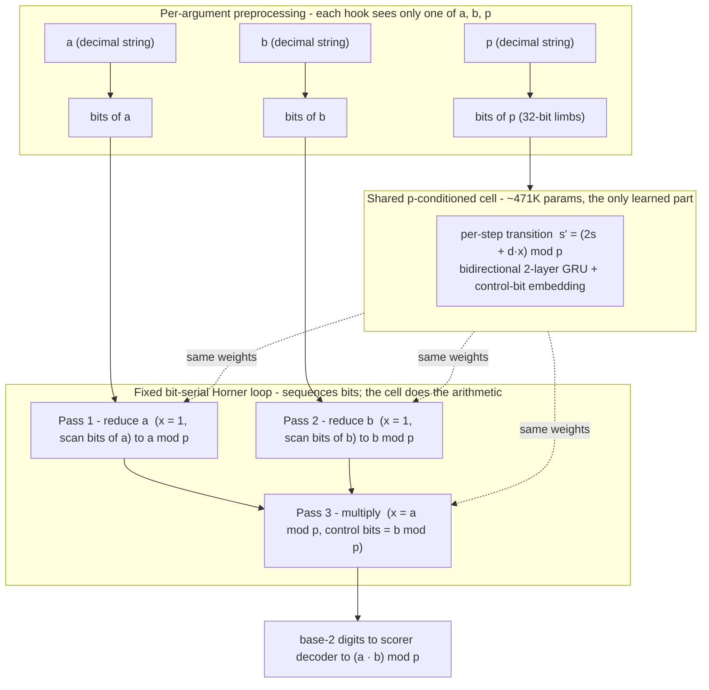

<p align="center">
  
</p>

# NeuralHorner: a modulus-conditioned bit-serial neural reducer

**Clears tiers 1-10 (official scorer, 3 local H100 runs inside the scorer's 300 s limit.)** One small recurrent cell, conditioned on the prime `p` and run in a fixed bit-serial loop, attains exact answers on the scored benchmark for primes and operands far beyond 64 bits. It is not universally exact. This repository records the SAIR Modular Arithmetic Challenge entry, its structured counterexamples, a failed repair, and a machine-checked proof of the integer algorithm the network imitates.

> **Status: incumbent preserved; repair stopped.** The only qualified and submitted artifact is `TrickyRex/bitserial-modmul-v8@301938693892043d66a8bf6ec60a9c5ab85549d4`. The direct two-pass L2-SP candidate is a negative research result, not a submission. No organizer compliance question was sent, and no ruling was requested or issued. See [What is not established](#what-is-not-established).

**Related work and independent convergence.**

>XllentAI's immutable historical modular_arithmetic snapshot predates NeuralHorner's first public GitHub commit and therefore has public priority for the modulus-conditioned Horner/double-and-add approach with hard binary state and held-out-prime transfer. NeuralHorner was developed independently; we became aware of XllentAI's work only after the NeuralHorner approach had already been developed. The independent convergence is notable: both systems arrived at essentially the same high-level algorithmic decomposition, while producing substantially different neural realizations. Neural Horner is 23× smaller by parameter count.

>XllentAI's current system uses two shared carry-aware TCN weight sets (~10.7M parameters) spanning tiers 1-10. NeuralHorner instead uses a single ~471K-parameter BiGRU checkpoint across all scored widths, reusing the same learned cell for operand reduction and multiplication, with no Python-side operand % p. We therefore claim neither priority for the Horner recurrence nor novelty of modulus conditioning, hard binary state, or cross-prime transfer. NeuralHorner's contribution is the independently developed compact all-phase realization, its challenge-width efficiency, and the accompanying exactness, failure-mode, and causal diagnostics.
**Paper:** [paper/paper_neuralhorner.pdf](paper/paper_neuralhorner.pdf).

## Architecture

NeuralHorner is one shared, modulus-conditioned bidirectional 2-layer GRU cell (~471K parameters) applied in a fixed bit-serial Horner loop. The cell learns the per-step transition `s' = (2s + d·x) mod p`; the same weights reduce `a`, reduce `b`, and multiply the two residues. State is carried as bits between steps; the modulus is fed as 32-bit limbs. Inference sizes the per-step state width to each prime's bit-length (dynamic-L). This is exact for the symbolic recurrence because padded high bits are zero; for the trained bidirectional GRU, full-width and dynamic-L inference agreed on the recorded 6/6 comparison, not on every possible input. Preprocessing is per-argument. The scorer entry class is `model.BitSerialReducer`.

The same learned cell runs at every step of a fixed bit-serial schedule; the loop sequences bits and does no arithmetic itself; the arithmetic is the learned cell's.


<details><summary>text version (Mermaid fallback)</summary>


```mermaid
flowchart TB
  subgraph IN["Per-argument preprocessing - each hook sees only one of a, b, p"]
    A["a (decimal string)"] --> Ab["bits of a"]
    B["b (decimal string)"] --> Bb["bits of b"]
    P["p (decimal string)"] --> Pb["bits of p (32-bit limbs)"]
  end

  subgraph CELL["Shared p-conditioned cell - ~471K params, the only learned part"]
    S["per-step transition  s' = (2s + d·x) mod p<br/>bidirectional 2-layer GRU + control-bit embedding"]
  end

  subgraph LOOP["Fixed bit-serial Horner loop - sequences bits; the cell does the arithmetic"]
    R1["Pass 1 - reduce a  (x = 1, scan bits of a) to a mod p"]
    R2["Pass 2 - reduce b  (x = 1, scan bits of b) to b mod p"]
    M["Pass 3 - multiply  (x = a mod p, control bits = b mod p)"]
    R1 --> M
    R2 --> M
  end

  Ab --> R1
  Bb --> R2
  Pb --> CELL
  CELL -. same weights .-> R1
  CELL -. same weights .-> R2
  CELL -. same weights .-> M
  M --> O["base-2 digits to scorer decoder to (a · b) mod p"]
```
</details>

## Training (summary)

The cell is trained from random initialization to predict the per-step transition on bit-length-stratified primes (AdamW with warmup + cosine decay, warm-started across widths), followed by an on-policy DAgger pass to close long-chain drift. The [paper](paper/paper_neuralhorner.pdf) describes the methodology. This repository does not currently provide a cleaned, end-to-end reproducible training release.

## Results

Submitted v8 artifact, official open-source scorer, full 1100-problem battery, run on a single H100 rented via RunPod. The three seeds are `a1a1a1a1`, `b2b2b2b2`, `c3c3c3c3`. Receipts: `model/receipts/d_*.json`.

| Property | Result |
|---|---|
| Qualified/submitted artifact | `TrickyRex/bitserial-modmul-v8@301938693892043d66a8bf6ec60a9c5ab85549d4` |
| Tiers cleared | 1-10 (htA90 = 10), overall 1.00 |
| Seeds | 3 independent runs, identical |
| Local H100 wall-clock | 163-174 s per run (inside the open-source scorer's 300 s limit; not a hardware-portability claim) |
| Determinism | re-run gives identical per-tier counts |
| bf16 vs fp32 on the tested battery | 0 flipped answers; min \|logit\| = 3.017. `LOCAL-RESULT/UNARCHIVED`: script present, primary output absent |
| Weight perturbation | randomizing the weights collapses every tier 0.00 (64/64 to 0/64) |
| Per-step transition | exact on 40,954 transitions in total across all primes < 64 (exhaustive) |
| Frozen structured battery | 759/768 = 98.83% (initially disjoint from v8 training; later used for repair selection) |

_Exact Clopper–Pearson 95% CIs on the random scored cases: each cleared tier (100/100) [0.964, 1.000], and the ten scored tiers pooled (1000/1000) [0.9963, 1.000]. Tier 0 is diagnostic and excluded. No sampling interval is attached to the hand-constructed frozen battery: its 768 rows contain 693 unique numerical cases, including only 53 unique alternating-pattern rows._

- **One compact shared checkpoint at challenge width.** The ~471K-parameter BiGRU reduces and multiplies modulo unseen primes through tier 10 using one weight set. Learned Horner updates and cross-prime transfer are prior art; the result here is the compact all-phase realization, learned operand reductions, scale, and measured boundary.
- **Learned, not a circuit.** Randomizing the weights collapses every tier to 0.00 (the organizers' named weight-perturbation anti-cheat). The forward path contains no symbolic-math library, no big-integer modular multiply, no lookup table, and no compare-against-`p` on the operands.
- **Not exact.** On first contact, the frozen structured battery scored 759/768 = 98.83%; the only failing family was Fermat numbers (`2^(2^n) + 1`), i.e. power-of-two-adjacent operands — and within that family the failures concentrate at the largest tested operand, `F_11 = 2^2048 + 1` (the top of the trained width range). The battery was subsequently used to select repair attempts, so it is now development evidence rather than a sealed generalization set. The fragility is narrow and characterized, but real.

## Direct two-pass study: a useful failed repair

We tested whether one learned operand-reduction pass could be removed without changing the learned primitive. The exact direct program uses `A+B` recurrent transitions instead of `A+B+Leff`: reduce one operand, then scan the other with the residue as `x`. Lean proves the direct integer recurrence in both operand orientations, but not that a trained checkpoint realizes every transition. On the pinned public benchmark, this program lowers a source-bound **recurrent bit-work proxy** by 20.001%. That number is an operation count, not measured latency or an end-to-end speedup.

The conservative repair interpolated v8 toward an L2-SP specialist at `alpha=0.875`. It cleared a receipt-bound F11 exact-prefix gate (193,116/193,116 transitions over 20 numerical cases in both orientations). That gate evaluates every transition from the exact teacher prefix; it is not a literal sequential, batched, or official-inference receipt. Rob also confirms that the immutable testing revision displayed `100/100` on each scored SAIR playground tier and `40/100` on unscored Tier 0. That playground result is `ROB-CONFIRMED/UNARCHIVED`: the screenshot/log, runtime, and evaluator identity are not preserved here. It is neither an official submission nor qualification evidence.

The F11 union is an immutable historical receipt, not a currently replayable
claim. Its recorded identities and counts validate internally, but the exact
older `trace_f11_trajectories.py` and `held_out_battery.py` source snapshots
bound by the receipt were later evolved and are not present in this checkout or
its recovery snapshot. The current scripts therefore define a new evidence
boundary and must not be presented as reproducing that union.

The broader frozen-development battery then rejected the candidate. Frozen-battery v3 stopped fail-closed at **509/512 attempted rows** after errors on fixed-Hamming source cases `003`, `035`, and `110`; the remaining **1,024 planned rows were not run**. The validator found no artifact, source, fixture, or cache-provenance mismatch, so this is model-failure evidence rather than an infrastructure abort.

Crossing v8 versus repaired weights with the original versus direct schedule separated three mechanisms:

| Case | v8/original | v8/direct | repaired/original | repaired/direct | Causal classification |
|---|---:|---:|---:|---:|---|
| `003` | pass | pass | pass | fail | weight/schedule interaction required |
| `035` | pass | fail | pass | fail | direct schedule sufficient |
| `110` | pass | pass | fail | fail | repaired weights sufficient |

Each failing arm has exactly one wrong teacher-state transition. Case `035` fails at the same direct-route transition under both weight sets; the repair worsens its local error from one wrong bit at margin -2.1741 to seven wrong bits at margin -13.2857. The scientific conclusion is a Pareto wall, not a repaired model: the interpolation fixes the known F11 transition but relocates error, while the direct schedule exposes an independent vulnerable trajectory. Promotion is stopped and v8 remains the incumbent.

Two ideas remain explicitly **unrun**: a zero-training screen of the existing function-space candidate on `035 → 110 → 003` and the complete F11 set, and design of a retention-constrained K-state counterexample miner. Neither is evidence of improvement, and no new training has run. Full receipts and decision rules are indexed in [`research/README.md`](research/README.md).

## Speed: dynamic state-width sizing

The symbolic state only needs the prime's bit-length, so sizing it per batch (dynamic-L) instead of a fixed maximum removes the compute the easy tiers otherwise spend on padding. The trained model was output-identical to full-width inference on the recorded 6/6 comparison; that finite check is not universal equivalence for the bidirectional GRU. On our H100, dynamic-L cut wall-clock from 383 s to 163--174 s, inside the open-source scorer's 300 s limit. It does not establish the same timing margin on other hardware.

CUDA graphs were tried and lost (402 s > 383 s baseline). The workload is compute-bound (the per-step GRU runs over the L-wide state), not launch-bound, so graph capture did not help; removing the wasted easy-tier compute did. We report the negative result because it explains why dynamic-L is the right lever.

## Verified algorithm (Lean 4)

`lean/` machine-checks (axioms `propext` and `Quot.sound`; no `sorry`/`admit`) the integer double-and-add `mod p` recurrence that the loop imitates, for any bit length. The package certifies the *integer algorithm*. It does **not** cover the learned network: the cell-to-step bridge connecting the trained weights to the proven step is open.

Toolchain: `leanprover/lean4:v4.31.0`. Build with `lake build` from `lean/`.

## Reproduce

```bash
python -m pip install torch numpy
neural_horner_scorer=/private/tmp/neural-horner-scorer-82510-replay
git clone https://github.com/SAIRcompetition/modular-arithmetic-challenge.git \
  "$neural_horner_scorer"
git -C "$neural_horner_scorer" checkout --detach \
  82510bba00a1126649bd76dd1a451f14d0b3eb60
PYTHONDONTWRITEBYTECODE=1 PYTHONPATH="$neural_horner_scorer/src" \
  python scripts/verify_no_shortcut.py model --randomize \
    --scorer-repo "$neural_horner_scorer"
cd lean && lake build
```

The scorer override must be the exact clean Git worktree root. The verifier
checks its commit, every committed byte in the inserted `src/` import tree,
declared contract hashes, and exact scorer-module import origins; untracked,
cached, or symlinked files anywhere in that tree are rejected. A run with
current research scripts creates a new evidence boundary, not a replay of the
historical F11 union.

Per-step exhaustive check (all states, primes < 64):

```bash
python scripts/per_step_exhaustive.py model --pmax 64
```

The submitted-v8 scorer, determinism, local timing, and weight-collapse results have receipts under `model/receipts/`. The bf16/fp32 checking script is `scripts/bf16_margin_check.py`, but its primary output is unarchived. Direct-candidate receipts are indexed separately in [`research/README.md`](research/README.md). Playground and automated-submission dashboard observations are explicitly unarchived and therefore have no repository receipt.

## What is not established

- **Automated leaderboard evaluation: `ROB-CONFIRMED/UNARCHIVED`; final ranked standing pending.** Rob reports that the submission dashboard scored tiers 1-10 = 100% (htA90 = 10) at 260 s, inside that evaluation's 300 s limit. The primary dashboard output is absent here. This is not a human or organizer verification, and the final ranking is not decided. The three receipt-backed local runs agree on accuracy; their 163--174 s timings are hardware-specific.
- **No organizer compliance ruling is claimed.** In the live source refresh on 2026-08-11, the rules still permit deterministic feedback-free token loops and now explicitly prohibit deterministic full-width operand pre-reduction. NeuralHorner's reductions are learned-cell passes, and the entry passes the automated weight-perturbation test. That source comparison is not a ruling: no question was sent, and no ruling was requested or issued. See the [rules-refresh receipt](research/receipts/rules_refresh_20260811.json).
- **Not exact.** See the frozen battery above (759/768 on first contact; Fermat-number failures). It is now development data after repeated repair selection. Tier-level scores of 1.00 are on the scorer's random-operand distribution, not a proof of exactness.
- **No direct-candidate promotion.** The L2-SP direct candidate's playground score is unarchived and its frozen-development run failed at 509/512 attempted rows. It was not substituted for v8 or submitted to SAIR.
- **Timing portability.** The unarchived automated submission observation is 260 s inside its 300 s limit; our receipt-backed local H100 runs were faster. Neither establishes performance on an unpublished or different final hardware image.
- **Proof scope.** The Lean package proves the integer algorithm, not the trained network.

## Roadmap

NeuralHorner is the most-scaffolded point (**"Level 0"**) of a scaffold-removal study, not the end state. The arc hands the fixed schedule back to the network in stages, to measure *how much algorithmic structure must be fixed* before neural modular arithmetic generalizes across primes. Three rungs beyond Level 0 have already been tried, with real negative results, not just planned:

- **Level 0** (this repo): fixed Horner loop + learned per-step transition. **Done** — clears all ten scored tiers.
- **Level 1**: learned controller (the network decides when to reduce / multiply) + learned transition. **Tried, negative.** An imitation-learned controller reached 100% per-step advance-accuracy at 2x operand length but 0% whole-sequence-exact: about 1.6% per-step error compounds over the ~2000-step rollout. The schedule has to stay fixed for exactness to survive at depth.
- **Level 2**: learned latent state, no explicit residue-bit representation. **Tried, negative.** A continuous latent state (a tied GRU cell carrying a vector instead of explicit bits) learns the one-step transition and transfers across primes (held-out exact-match 0.89 to 0.96), but per-step decode accuracy collapses to chance within 12-16 Horner steps regardless of scan width -- even with an exact target supervised at every step. Level 0's per-step re-quantization to clean bits is doing real work as a denoiser that resets drift each step; removing it, not just the explicit bit representation, is what breaks at depth.
- **Level 3**: a Neural-GPU-style recurrent bit processor — no Horner phases. Not yet attempted.
- **Level 4**: a looped / universal transformer. Not yet attempted.
- **Level 5**: a monolithic transformer (the original wall). **Tried, negative.** A real decoder-only transformer (abacus embeddings, Charton-Kempe data, weight decay) memorizes training primes to train-exact 1.000 but held-out cross-prime exact-match sits at ~0.13 and does not move; run 16x longer (100k steps, the canonical grokking setup) it stays flat rather than groks. Multiplication does not grok the way addition does.

Nearer-term:
- **Direct two-pass/L2-SP repair: stopped, with a causal result.** The direct schedule lowers a recurrent bit-work proxy by 20.001% and the interpolated checkpoint repairs the known F11 path, but frozen-battery v3 fails at 509/512 attempted rows. The four-way trace separates a schedule failure, a weight failure, and a weight/schedule interaction. This is a negative result worth preserving, not a near-pass to round up.
- **Failure-mode analysis: done. Fix: not closed, and now understood why.** The Fermat residual is
  localized to one exact transition (`reduce_a`, step 2048, `s=2^2047`, the `(2^2048+1) mod p` wrap --
  the preceding 2048 doublings are exact). Five repair methods were tried against the full 768-case
  frozen development battery (not just the small gauntlet, which is misleading): off-policy boundary curriculum,
  on-policy Fermat DAgger, all-family DAgger, boundary-sweep DAgger, PCGrad gradient surgery. Every one
  either relocates the failure to a different family or regresses the overall battery below v8's
  759/768. A frozen one-step overfit reaches 1.0 on every development family, so capacity is not the
  limit -- this is a coverage/rollout-drift limit, and it resists targeted fixes specifically because
  they redistribute rather than remove it.
- **Trace-certification: done.** Every transition checked against `s' = (2s+dx) mod p` on tier 9
  (9228/9228 verified) and tier 10 (12294/12294 verified); the Fermat first-divergence is localized
  exactly (see above).
- **Ablations: mostly done.** Fixed-L (full 2048-wide) and dynamic-L agree on the recorded comparison (6/6 correct,
  13080/13080 transitions verified). This supports that finite inference choice but is not a universal
  equivalence theorem for the bidirectional GRU. Zeroing the modulus conditioning collapses to 0/6 -- confirms conditioning is
  load-bearing, not decorative. A no-DAgger ablation is not yet isolated separately.
- **Training-script release; preprint: not yet done.** Internal training scripts exist
  (`src/mac/training/`) but nothing has been cleaned up and released publicly, and no preprint has been
  written or submitted.

## Citation

See [`CITATION.cff`](CITATION.cff). Robert Sneiderman, *NeuralHorner: a learned bit-serial modular reducer*, 2026. https://github.com/Robby955/neural-horner

## Author

Robert Sneiderman

Corrections and issues welcome.
